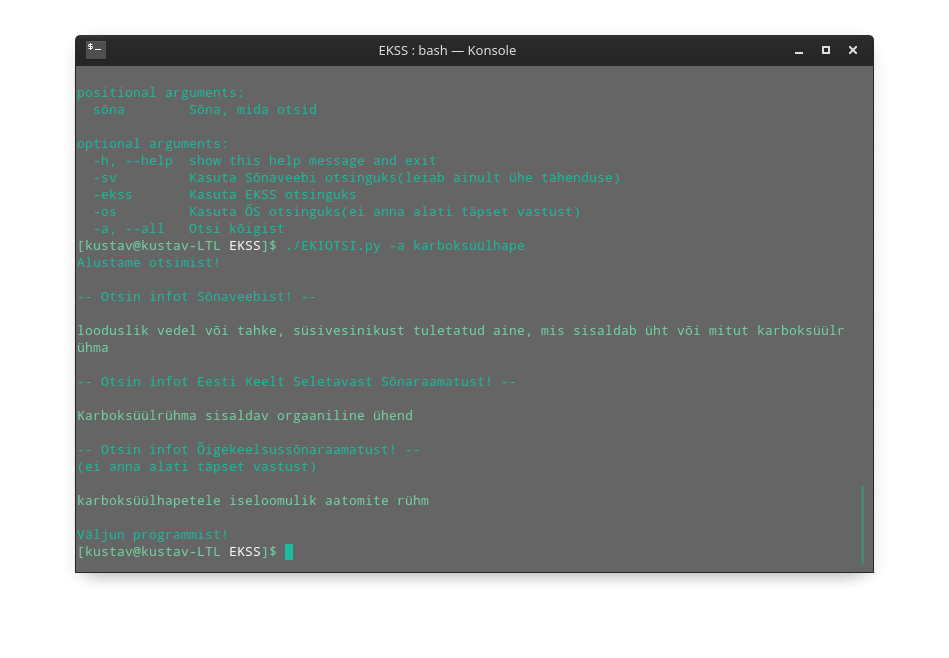

# EKIOtsing
####Otsi sõna tähendust EKI lehtedelt (Sõnaveeb, EKSS, ÕS)  

---
- ###Installimine
    - Klooni repo
    ``git clone https://github.com/LordzShadow/EKIOtsing.git``
    - Installi pythoni moodulid ``pip install bs4 requests``
    - Liigu reposse ``cd EKIOtsing``
    - Kui on soov runnida linuxis ``./EKIOTSI.py <asjad>``, siis ``sudo chmod +x EKIOTSI.py``

- ###Kasutamine
    - ``python EKIOTSI.py <valikud> sõna``
    - Valikud on:
        - -sv | kasuta Sõnaveebi otsimiseks
        - -ekss | kasuta EKSS-i otsimiseks
        - -os | kasuta ÕS-i otsimiseks
        - -a või --all | kasuta kõiki otsimiseks

